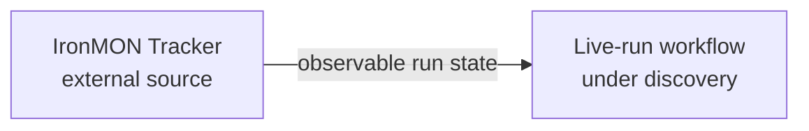

# Context map

The initial discovery identifies one live-run workflow but does not yet show
distinct language, rules, responsibilities, or ownership that would justify a
bounded context. No bounded context has therefore earned an active boundary.

The IronMON Tracker is an external upstream source for observable run state.
Whether observing that state and presenting a live channel require separate
contexts remains an open modeling question rather than an asserted boundary.

Update this diagram and its explanatory prose whenever a context is created,
activated, retired, or changes relationship.
