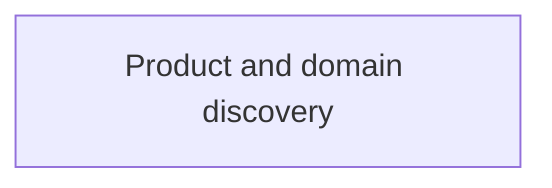

# Context map

The context map records bounded contexts and their strategic relationships. No
bounded context has yet earned an active boundary.

Update this diagram and its explanatory prose whenever a context is created,
activated, retired, or changes relationship.
